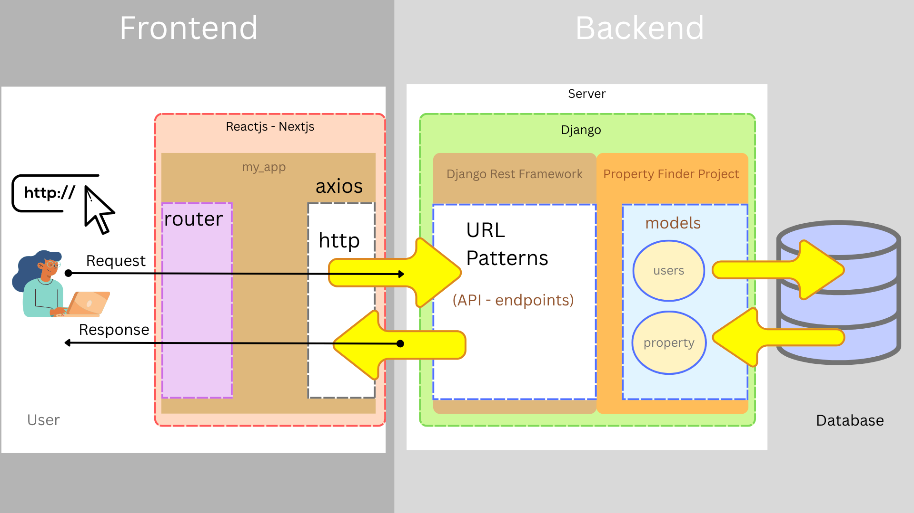
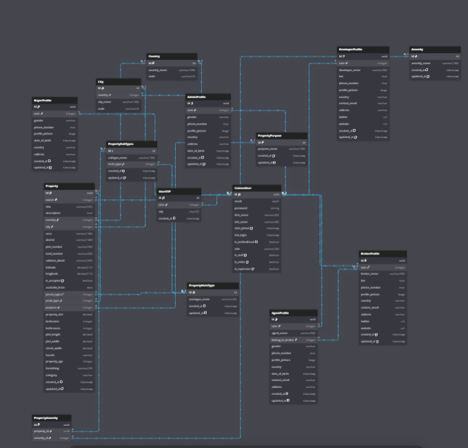

# 🏡 Property Finder Project(Work In Progress)
This is a full-stack property finder web application, inspired by platforms like Property Finder Saudi Arabia (you can change to any country).
It allows users to search, list, and manage properties for sale or rent, with features tailored to different types of users.

## Screen shoot :

## Project Technology :

| Component     | Technology              |
| ------------- | ----------------------- |
| Backend       | Django 5.x              |
| API Framework | Django REST Framework   |
| Auth          | JWT (Simple JWT)        |
| Database      | PostgreSQL (via Docker) |
| Deployment    | Docker & Docker Compose |
| Frontend      | NextJS                  |
| HTTP cookies  |  Http Only Cookies      |

## System Architecture:

## ER Diagram:

https://dbdiagram.io/d/Property-Finder-68df410ed2b621e42210ee1f

## 🔑 Key Features
- Role-based access control (5 user types)
- Property listings with detailed information (location, price, type, images, etc.)
- Advanced search & filtering (buy, rent, commercial, residential, etc.)
- Secure authentication (JWT with HTTP-only cookies)
- Admin dashboard for managing users and properties
- Modern frontend built with Next.js (React)
- Robust backend built with Django REST Framework (DRF)

## 👥 User Roles
The system is powered by a CustomUser model with a role field, which determines user type and permissions.

### Admin
- Full access to all data
- Manage users and property listings

### Developer
- Can list multiple properties (apartments, villas, etc.)
- Typically represents a real estate development company

### Broker
- Can manage property listings
- Can have Agents working under them

### Agent
- Works under a Broker
- Can list and manage properties on behalf of the broker

### Buyer
- Can search, browse, and inquire about properties
- Can save favorite listings.

## ⚙️ Tech Stack
- Backend: Django REST Framework (DRF)
- Frontend: Next.js (React, TypeScript-ready)
- Database: PostgreSQL (recommended, but can work with SQLite/MySQL)
- Authentication: JWT (stored in HTTP-only cookies) with refresh token logic
- Deployment-ready with modular, scalable architecture.

## 🚀 Project Goal
The goal of this project is to create a scalable, role-based property listing platform where different user types can interact in a real estate ecosystem — just like on Property Finder.

## 🛠️ Usage Flow
Here’s how different users interact with the platform:
### Registration & Login
#### Buyers (normal users):
Can directly sign up and start browsing properties.
#### Developers, Brokers, and Agents:
Must first go to the “Join Us” page and submit an application form (with full name, email, job, experience, etc.).
The Admin team reviews the request.
If approved, the applicant receives a special registration link via email to create an account as a Developer, Broker, or Agent.
#### Admins: 
Created manually from the backend with full access rights.

## Property Listing
Developers, Brokers, and Agents can create property listings (with images, details, and pricing).

## Searching & Browsing
Buyers browse listings using filters (buy/rent, price range, location, property type).

## Connecting
Buyers contact Agents or Brokers for more details.
Agents respond on behalf of Brokers or Developers.

## Management & Control
Admins oversee the entire platform, review role requests, and manage users and properties.

